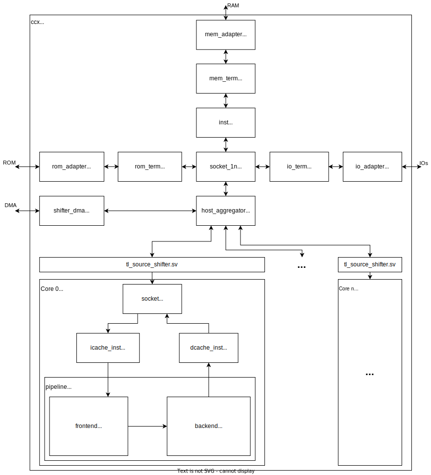

# Muntjac SoC

This repository contains a simple SoC that builds upon [muntjac](https://github.com/lowRISC/muntjac) that can be used out-of-the-box.

For a detailed walkthough about how to build/use this project, please check the [tutorial](./docs/tutorial.md). A description of the core complex can be found [here](./docs/ccx_architecture.md).

## Components

The SoC contains the following components out of the box:
* 2 Muntjac cores
* Interrupt controller and timer (PLIC and CLINT)
* Flash memory controller[^1] (work in XIP mode)
* DDR memory controller[^1]
* UART 16550[^1]
* SD card controller
* PS/2 controller[^3]
* *(optional)* Ethernet controller[^2]
* *(optional)* Display controller[^3]

[^1]: Xilinx IP that comes with Vivado, but not open source
[^2]: Xilinx IP, not open source, separate license required
[^3]: For Nexys Video and Genesys 2 boards only

## SoC architecture

The core complex rtl file [ccx.sv](rtl/ccx.sv) is common to all developpement boards. It can be divided into several modules.
* Memory, ROM and IO adapter ([tl_adapter.sv](muntjac/ip/tl/rtl/tl_adapter.sv)): Converts two TileLink links with different parameters
* Memory, ROM and IO terminator ([tl_adapter.sv](muntjac/ip/tl/rtl/tl_adapter.sv)): Converts TL-C to TL-UL, we don't need cache consistency after this module.
* Memory L2 cache ([muntjac_llc.sv](muntjac/ip/core/rtl/muntjac_llc.sv)): Last level cache shared by all the cores.
* Socket 1 -> N ([tl_socket_1n.sv](muntjac/ip/tl/rtl/tl_socket_1n.sv)): Converts one TL bus to N buses.
* Socket M -> 1 ([tl_socket_m1.sv](muntjac/ip/tl/rtl/tl_socket_m1.sv)): Aggregates the buses from the cores into one.
* Core ([muntjac_core_wrapper.sv](muntjac/ip/core/rtl/muntjac_core.sv)): One muntjac RISC-V core.
* Data cache ([muntjac_dcache.sv](muntjac/ip/core/rtl/muntjac_dcache.sv)): L1 data cache.
* Instruction cache ([muntjac_icache.sv](muntjac/ip/core/rtl/muntjac_icache.sv)): L1 instruction cache.
* Frontend ([muntjac_frontend.sv](muntjac/ip/pipeline/rtl/muntjac_frontend.sv)): Muntjac's frontend is the beginning of the pipeline. It contains the PC generator, the instruction fetch and alignement stages.
* Backend ([muntjac_backend.sv](muntjac/ip/pipeline/rtl/muntjac_backend.sv)): End of the pipeline. It contains the remaining stages of the pipeline.

## Supported Targets

Currently these FPGA boards are supported:
* Nexys A7
* Nexys Video
* Genesys 2

## Licensing

Unless otherwise noted, everything in this repository is dual-licensed in the MIT license and the Apache
License, Version 2.0. See [LICENSE-APACHE](./LICENSE-APACHE), [LICENSE-MIT](./LICENSE-MIT) for details.
